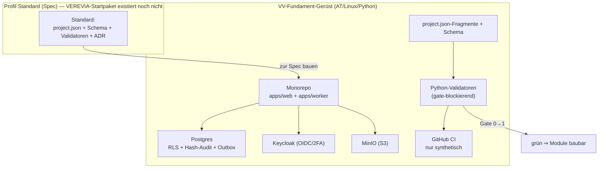

# Bau-Dossier — VV-STAGE-0 · Startpaket-Harvest (Fundament-Gerüst)

> **Kurz-Bau-Dossier Stage 0.** 9-teilige Vorlage (K29). Dokumentiert das geprüfte
> Bau-Gerüst, gegen das danach jedes Modul gebaut wird. **Kein Modul-Bau, keine echten Daten.**

## 1. Kopf

- **Code:** VV-STAGE-0
- **Name:** Startpaket-Harvest — Fundament-Infrastruktur
- **Version:** 1.0
- **Datum:** 16.09.2026
- **Verantwortlich:** Bau-KI (Claude Code + Opus 4.8, Aufwand hoch) · Review = Fremdmodell (Aufwand hoch)
- **Status/Gate:** gebaut · R1 nicht bestanden → WP0–WP7 · R2 → F1–F8 · R3 (CRITICAL Metadaten-Spoofing) → G1–G9 · R4 (Codex+Gemini zusammengelaufen auf 2 echten Befunden; Rest = Upload-/Pfad-Artefakte) → **Reparaturrunde 4 (H1 approved_by-Bindung, H2 Hard-Crash-DLQ) umgesetzt & gegen echte PostgreSQL 16 verifiziert** (22.09.2026) · **Gate 0→1: erneutes Fremdmodell-Review ausstehend** (siehe `REVIEW-Befunde-Stage-0.md`, `evidence/stage-0/round4-verification.md`)

## 2. Was

Erzeugt wurde das **Bau-Gerüst** nach Profil „Standard". **Hinweis:** Das VEREVIA-Startpaket
**existiert noch nicht** (16.09.2026) — das Gerüst wurde daher **direkt zur entschiedenen Spec**
(ADR-01…11, ADR-09, K29) gebaut; das Ergebnis entspricht dem, was ein Harvest nach dem Strippen
ergäbe. Umgestellt auf **VV/AT/Linux/Python**:

- **Monorepo** mit einem Migrations-Set: `apps/web` (modularer Monolith), `apps/worker`
  (Agenten-/Job-Worker), `db/migrations`, `db/seed` (nur synthetisch).
- **`docker compose`-Stack:** Web/API + Worker + Postgres + Keycloak + MinIO.
- **`project.json` in Fragmenten** je Baustein (13 Fragmente) + **JSON-Schema** + Merge-Schritt.
- **Python-Validatoren**, die die ADR-Invarianten **gate-blockierend** erzwingen.
- **ADR-01…11 als Referenz-Fragmente** (`docs/adr`) + **Bau-Dossier-Skeletons** (9 Abschnitte) je Baustein.
- **CI (GitHub)**: Build + Validatoren, **nur synthetische Daten**.
- **Doku-Pipeline** (`scripts/build_html.py`, `fix_lists.py`, `mermaid.min.js`).

**Nicht** gebaut (Nicht-Ziele): Fachmodule (M##), Agenten-Fachlogik, Live-Bank/SEPA, Prod-Deploys, echte Daten.

## 3. Warum so

Grundgerüst-Profil „Standard" (K17/K28). Das VEREVIA-Startpaket („Erstversuch, IP = Betreiber")
war als Harvest-Quelle vorgesehen, **existiert aber noch nicht** — daher zur entschiedenen Spec
gebaut statt geerntet (Inhalte wären ohnehin gestrippt worden). Die 10 VEREVIA-Architekturpunkte
sind über ADR-01…11 bereits **neu entschieden** → [ADR-01…11](../adr/ADR-01.md) (K30/K33); die
VEREVIA-Formulierung in K17/K28 ist als offene Frage vermerkt (Register). Ebenentrennung:
Register = Mensch · `project.json` = Maschine · ADR = Architektur.

## 4. Wie umgesetzt

- **Mandantentrennung (ADR-01):** `tenant_id` + Postgres-RLS + Policy je Tabelle; App-Rolle ohne BYPASSRLS.
- **Modularer Monolith (ADR-02):** Modulgrenzen, kein Cross-Modul-Import; Worker getrennt.
- **Policy-Prüfpunkt (ADR-04):** `apps/web/src/platform/policy.ts`, deny-by-default; jede `*.action.ts` geht hindurch.
- **Audit/Events (ADR-05):** Hash-Ketten-Audit + Transactional-Outbox (`db/migrations/0003`).
- **Jobs (ADR-06):** pg-boss im Worker, idempotent.
- **Agenten (ADR-07):** Vier-Augen-Automat + Pseudonymisierungs-Gateway (Struktur/Guards).
- **Projektwahrheit (ADR-09):** Fragmente + Schema + Validatoren.
- Grenzen: reines Gerüst; keine Fachlogik, keine echten Daten.

## 5. Wie getestet

Validatoren lokal ausgeführt, alle Gates grün; Compose-Konfiguration normalisiert geprüft.
Evidenz: [../../evidence/stage-0/gate0-checklist.md](../../evidence/stage-0/gate0-checklist.md) ·
[Validator-Report](../../evidence/stage-0/validator-report.json) ·
[Compose-Config](../../evidence/stage-0/compose-config.txt)

Akzeptanz (Gate 0→1): `docker compose up` startet den Stack · Validatoren lokal **und** CI grün ·
Fragmente+Schema valide · ADR-Fragmente im Repo · Dossier-Skeletons je Baustein · CI nur synthetisch.

## 6. Sicherheit & Datenschutz

- **100 % AT-Datensouveränität**, kein US-Dienst im Datenpfad; host-agnostisch.
- **Kein Personenbezug im Repo/CI** (Guard-Validator K31); nur synthetische Testdaten.
- Bindendes nie autonom: Freigabe-Objekt (Vier-Augen), lückenloses Audit ab Tag 1 (K31).
- **Nach Reparatur (WP1–WP6):** App-Rolle `vv_app` NOSUPERUSER+NOBYPASSRLS (kann RLS nicht umgehen); Tenant-Kontext transaktions-lokal; Audit append-only mit DB-seitiger, fork-freier Hash-Kette; Policy deny-by-default; OIDC-Bearer-Validierung; Least-Privilege-Secrets je Dienst.

### Abgrenzung — spätere Infra-Stufe (bewusst NICHT in Stage 0)

Diese ADR-08/11-Betriebskomponenten sind **spätere Infra-Stufe** (Betreiber-Entscheidung 17.09.2026), kein Stage-0-Umfang: **ClamAV**-Upload-Scan · **Backup/PITR** + **Offsite-WORM** (die Tabelle `audit_anchor` ist eine DB-Tabelle, **noch keine** echte WORM-Senke) · **Monitoring/Alerting** · **`sops`/`age`**-Secrets. Stage 0 liefert das Sicherheits-Kern-Gerüst; diese Härtungen folgen mit ADR-11 in einer eigenen Stufe.

## 7. Visual (Pflicht)

## 8. Nutzen in Klartext

Ab jetzt gibt es ein **geprüftes, sich selbst kontrollierendes Bau-Fundament**: Jedes künftige
Modul wird gegen dieselben harten Regeln gebaut (Mandantentrennung, ein Policy-Prüfpunkt,
lückenloses Audit, Vier-Augen, vollständige Doku). Fehler fliegen automatisch am Gate auf,
bevor etwas live geht — Echtbetrieb-Disziplin ab dem ersten Baustein.

## 9. Änderungshistorie

- 16.09.2026 — Stage 0 gebaut (Startpaket-Harvest); K22 auf „Bau gestartet/Stage 0".
- 17.09.2026 — Vier-Augen-Review R1 (Codex + Gemini) = nicht bestanden; **Reparatur WP0–WP7** (Git-Repo, RLS-Rollentrennung, Transaktions-Wrapper, DB-seitige Audit-Kette, deny-by-default, Vier-Augen-Guards, OIDC, gehärtete Validatoren gegen echte PostgreSQL + AST, ehrliche Evidenz, Scope-Abgrenzung ADR-08/11).
- 17.09.2026 — Review R2 des reparierten Stands: Codex „nicht bestanden" (8 Befunde), Gemini „bestanden mit Auflagen" (4). **Reparaturrunde 2 (F1–F8):** Vier-Augen `binding` server-seitig + Adversarial-Test; eigene Rolle `vv_worker` (Outbox-EXECUTE nur Worker) + `pgboss`-Schema; Audit-Hash kanonisch inkl. id + TRUNCATE-Sperre; Validatoren gegen dyn. Import / ignorierte Policy-Entscheidung / Live-Skip-als-PASS / Mermaid gehärtet; Keycloak-Mapper (tenant_id/roles/aud); Passwort-Setzen ohne String-Interpolation; Guard entpackt XLSX/ZIP. Verifiziert gegen echte PostgreSQL 16 + adversarial (`evidence/stage-0/round2-verification.md`).
- 18.09.2026 — Review R3: Codex „nicht bestanden" (CRITICAL: Vier-Augen über **Metadaten-Spoofing** umgehbar — `actionClass`/`state`/`token` waren Aufrufer-Daten; + 4 HOCH), Gemini „bestanden mit Auflagen" (F6 nach vollständigem Upload grün). **Reparaturrunde 3 (G1–G9):** Effekt-Registry (fixe Senken-Identität) + Executor + **DB-Freigabe atomar** (`vv_consume_approval`: fremd-genehmigt/scope/ablauf/einmal); vv_app Outbox nur INSERT/SELECT; Validatoren gegen Template-Literal-Import / String-Decoy-Guard / Destrukturierung; Guard maskiert Archiv-Dateinamen; Report SKIP≠PASS; Mermaid echter Parser (CI mmdc); Outbox retry_count/DLQ. Verifiziert gegen echte PostgreSQL 16 + adversarial (`evidence/stage-0/round3-verification.md`).
- 22.09.2026 — Review R4: Codex (harness-basiert; PASS=8/FAIL=28 = Git-Bash-Pfadartefakte, kein Produkturteil) + Gemini („nicht bestanden", aber dominiert von Upload-Truncation) laufen auf **zwei** echten Befunden zusammen. **Reparaturrunde 4:** **H1** `approved_by` an transaktionsgebundenen `app.actor` gebunden (vv_app verliert direktes UPDATE; Entscheidung nur über `vv_decide_approval`, Freigeber aus verifiziertem Actor, SoD erzwungen); **H2** Outbox-DLQ auch bei HARTEM Crash (Reaper `dead_at WHERE attempts>=5` + Claim `attempts<5`). Verifiziert gegen echte PostgreSQL 16 (`evidence/stage-0/round4-verification.md`). Erneutes Fremdmodell-Review ausstehend.
