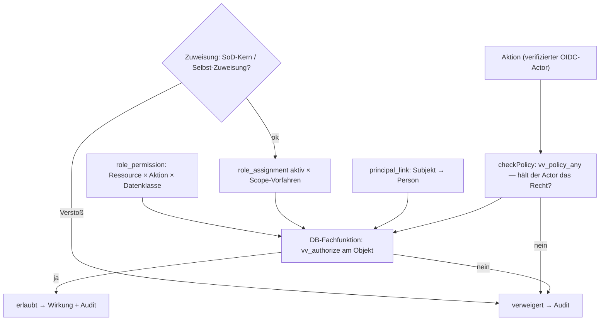

# Bau-Dossier — VV-BASIS-02 · Rollen & Rechte

> **Bau-Dossier (K29).** Stage 0 = Skeleton; **Kern mit Modul M05 gebaut** (Register P50-8), weil die Feldsicht von M05 sonst nur eine Attrappe wäre.
> **Status: in_bau — Vier-Augen-Review + Betreiber-Freigabe ausstehend.** Vereinsrollen (tenant-lokal), Delegation (B02-2) und Erziehungsberechtigten-Sicht folgen.

## 1. Kopf

- **Code:** VV-BASIS-02
- **Name:** Rollen & Rechte
- **Version:** 0.4 (Kern, C-1)
- **Datum:** 24.09.2026
- **Verantwortlich:** Bau-KI Claude Code + Opus 5.5 · Prüf-KI Fremdmodell (ausstehend) · Freigabe Betreiber
- **Status/Gate:** in_bau · Gate 1 gemeinsam mit M05 (gesperrt bis Review + Freigabe)

## 2. Was

- **Datengetriebene Rechteprüfung** ersetzt die statische Stage-0-Allowlist: Rolle × Scope-Knoten × Ressource × Aktion × Datenklasse (Ö/S/Se/F-Buch/F-Bank/A9), deny-by-default.
- **Systemrollen** (Seed, 12 Rollen) mit **Rechteprofilen** (M05-Ausschnitt der Default-Matrix, Baubuch BASIS-02) und **SoD-Kern-Katalog** (B02-1: Kassier ≠ Kassaprüfer, Kassaprüfer ≠ Vorstand/Obmann/Mandanten-Admin).
- **Vererbender Scope-Baum** Verein → Abteilung → Mannschaft; Rolle am Knoten wirkt nach unten; `self`-Rechte für eigene Daten.
- **Principal-Bindung** OIDC-Subjekt → Person je Verein (nur Betreiber-Onboarding).
- **Befehle:** Rolle zuweisen/widerrufen (Recht + keine Selbst-Zuweisung + SoD), Scope-Knoten anlegen.

## 3. Warum so

- [ADR-04](../adr/ADR-04.md): RBAC im App-Layer mit **einem** Prüfpunkt — hier ergänzt um dieselbe Prüfung **in der DB** (Defense-in-Depth), weil die Web-Rolle sonst über direktes DML Rechte fälschen könnte.
- [ADR-01](../adr/ADR-01.md): RLS bleibt der Mandanten-Boden; die Definer-Rolle `vv_definer` hat **kein** BYPASSRLS.
- Principal-Bindung nicht für die App: sonst könnte ein Admin sein Subjekt an die Person des Obmanns binden (Rechte-Übernahme). Einladungs-/Registrierungsfluss folgt mit BASIS-10.
- Selbst-Zuweisung verboten (Vier-Augen-Geist: niemand erhöht die eigenen Rechte).

## 4. Wie umgesetzt

- Migration [0006_rbac_core.sql](../../db/migrations/0006_rbac_core.sql): `role_type`, `role_permission`, `sod_rule` (global) · `scope_node`, `principal_link` (RLS) · `role_assignment` + Scope-FK, Widerruf, Trigger `vv_role_assignment_guard` (SoD + nur Widerruf änderbar, serialisiert je Person).
- Funktionen: `vv_authorize(_subject)`, `vv_policy_any`, `vv_person_scopes`, `vv_scope_ancestors`, `rbac_assign_role`, `rbac_revoke_role`, `rbac_create_scope_node`; Onboarding `rbac_onboard_root`, `rbac_link_principal` (nur Bootstrap).
- App: [policy.ts](../../apps/web/src/platform/policy.ts) ruft `vv_policy_any` im Tenant-/Actor-Kontext, fail-closed, protokolliert Verweigerungen.
- `vv_app`: kein INSERT/UPDATE/DELETE auf `role_assignment`, kein Zugriff auf `principal_link`. **Seit C-1 (VV-SEC-01, 26.09.2026):** überhaupt keine Tabellenrechte mehr; Lesen nur über `basis02_list_role_assignments()`, Rollen vergeben/entziehen (`rbac_assign_role`/`rbac_revoke_role`) nur mit geprüftem Ticket und als **Einmal-Aktion**; der SoD-Trigger arbeitet fail-closed ohne passenden Kontext; Akteur für Autorisierung/SoD = geprüfter Ticket-Akteur statt frei setzbarer GUC.

## 5. Wie getestet

- Gegenproben in [scripts/m05_db_asserts.py](../../scripts/m05_db_asserts.py): SoD blockiert (Ergebnis + Audit), SoD-Trigger auch für direkten Eintrag, Selbst-Zuweisung verboten, Rolle nur mit Recht vergeben, Zuweisung nicht umdeutbar, Trainer-Scope nur eigenes Team, Mandantentrennung, keine Funktion für PUBLIC.
- Unit-Tests Prüfpunkt: [policy.test.ts](../../apps/web/src/platform/policy.test.ts).
- Nachweise: [evidence/m05/db-asserts.txt](../../evidence/m05/db-asserts.txt) · [evidence/m05/verification.md](../../evidence/m05/verification.md).

## 6. Sicherheit & Datenschutz

- Deny-by-default in App **und** DB; Systemakteure (`system:*`) haben nie Rollen.
- SoD-Kern ohne Override, bei der Zuweisung geprüft; versuchte Verletzung auditiert.
- Feldsicht über Datenklassen; Se/A9 nur laut Matrix (M05: Se für Vorstand/Obmann/Kinderschutz, P50-13).
- Alle Rechteänderungen ins Audit (Hash-Kette) + Outbox.

## 7. Visual (Pflicht)

## 8. Nutzen in Klartext

Jede Person sieht und tut nur, was ihre Funktion im Verein verlangt — der Trainer sein Team, der Kassaprüfer prüft nur. Unvereinbare Funktionen lassen sich gar nicht erst vergeben.

## 9. Änderungshistorie

- 16.09.2026 — Skeleton angelegt (Stage 0 Startpaket-Harvest).
- 24.09.2026 — v0.3: Reparaturrunde 1 (P52): zentraler Prüfpunkt wertet `scopeNode` aus (`verein` = Wurzelrecht, `<uuid>` = Knoten, `any` nur bei DB-Objektprüfung, sonst deny; R7); Freigeber-Recht × Scope jetzt auch DB-seitig in `vv_decide_approval` (R4). Details: [VV-M05 §6a](VV-M05.md).
- 24.09.2026 — v0.2: Kern mit M05 gebaut (P50-8): datengetriebene Prüfung App + DB, Scope-Baum, Seed-Rechteprofile, SoD-Kern-Trigger, Principal-Bindung. Review + Freigabe ausstehend.
- 26.09.2026 — v0.4: **C-1 Kontext-Signatur** ([VV-SEC-01](VV-SEC-01.md), PR #21 → `master` `73455a3`): Kontext (Mandant/Akteur) nur noch aus geprüftem Ticket; Direktrechte von `vv_app` entfallen; Rollenvergabe/-entzug als Einmal-Aktion; SoD-Trigger fail-closed. Restrisiko C-1 geschlossen.
