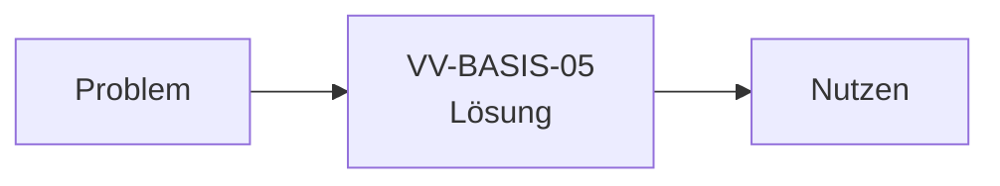

# Bau-Dossier — VV-BASIS-05 · Kommunikation

> **Skeleton (Stage 0).** 9-teilige Vorlage (K29). Die Bau-KI füllt die Abschnitte beim
> Modul-/Baustein-Bau aus; Prüf-KI + Validator erzwingen Vollständigkeit (Gate-Sperre).
> **Kein Bau-Inhalt bis zur Baustein-Freigabe.**

## 1. Kopf

- **Code:** VV-BASIS-05
- **Name:** Kommunikation
- **Version:** 0.1 (Skeleton)
- **Datum:** 16.09.2026
- **Verantwortlich:** Bau-KI (Claude Code + Opus 4.8) · Prüf-KI (Fremdmodell)
- **Status/Gate:** Skeleton · Gate 0

## 2. Was

*(zu füllen beim Bau)* Ziel dieses Bausteins: Dokumentierte, consent-gepgatete Outbound-Zustellung mit Nachweis (Ruhe statt WhatsApp-Chaos).

## 3. Warum so

*(zu füllen beim Bau)* Hintergrund/Alternativen → ADR-Verweis: [ADR-05](../adr/ADR-05.md), [ADR-06](../adr/ADR-06.md)

## 4. Wie umgesetzt

*(zu füllen beim Bau)* Architektur, Datenmodell, Schnittstellen, Grenzen. Referenz: [ADR-05](../adr/ADR-05.md), [ADR-06](../adr/ADR-06.md)

## 5. Wie getestet

*(zu füllen beim Bau)* Testarten, Ergebnisse/Evidenz-Verweise, Akzeptanzkriterien.
Evidenz: [../../evidence/stage-0/gate0-checklist.md](../../evidence/stage-0/gate0-checklist.md)

## 6. Sicherheit & Datenschutz

*(zu füllen beim Bau)* Kontrollen, Datenklassen (Ö/S/Se/F-Buch/F-Bank/A9), Freigaben.

## 7. Visual (Pflicht)

## 8. Nutzen in Klartext

Wichtiges kommt an und ist belegt — ohne Reizflut, über gewohnte Kanäle.

## 9. Änderungshistorie

- 16.09.2026 — Skeleton angelegt (Stage 0 Startpaket-Harvest).
