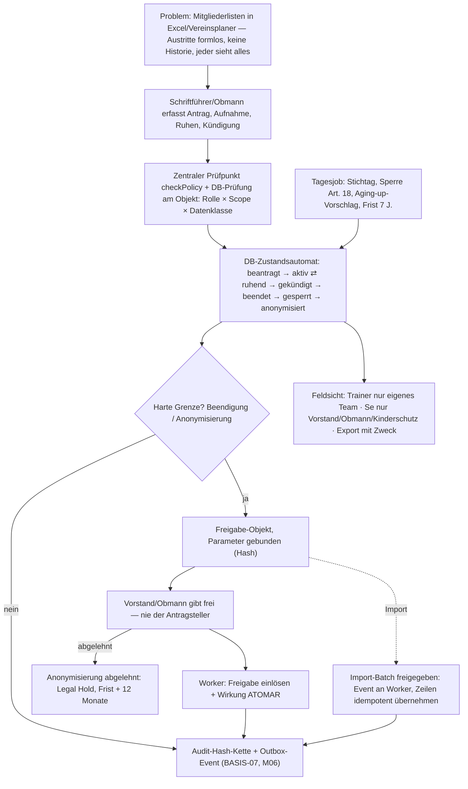

# Bau-Dossier — VV-M05 · Mitglieder (Mitglieder-CRM)

> **Bau-Dossier (K29).** Phase 1, gebaut zur geschärften Spec (Baubuch v0.20, Steckbrief VV-M05; Register P50).
> **Status: in_bau — Reparaturrunde 1 (R1–R8, G-1–G-3) und Review Runde 2 (Codex GPT-6 Sol + Gemini 3.1 Pro) mit Reparaturrunde 2 umgesetzt; Bestätigungs-Review und Betreiber-Freigabe ausstehend.** Die Bau-KI öffnet kein Gate.

## 1. Kopf

- **Code:** VV-M05 (+ BASIS-02-Kern, P50-8)
- **Name:** Mitglieder (Mitglieder-CRM)
- **Version:** 1.2 (Phase 1 + Reparaturrunden 1 und 2)
- **Datum:** 24.09.2026
- **Verantwortlich:** Bau-KI Claude Code + Opus 5.5 (Stufe hoch) · Prüf-KI GPT-5.x Codex + Gemini 3.x Pro (ausstehend) · Freigabe Betreiber
- **Status/Gate:** in_bau · Gate 1 (M05) **gesperrt bis Review + Betreiber-Freigabe**
- **Grundlage:** Bau-Auftrag v1.1 (Projektordner, `VV_M05_Bau-Auftrag.md`) · Register P50 · Repair-Auftrag Sicherheitsbefunde + Befund-Bewertung (Register P52) · [project.json-Fragment](../../project/fragments/VV-M05.project.json)

## 2. Was

Die **fachliche Mitgliedschaft** auf Basis der Person (BASIS-01): wer ist auf welche Art, seit wann, in welchem Status Mitglied. Umgesetzt (Use Cases des Steckbriefs):

- **Mitgliedsarten zweischichtig:** System-Kategorien (aktiv · unterstützend · fördernd · Ehren · Jugend) + versionierte Vereins-Mitgliedsarten mit Kündigungsregel (Frist + Stichtag) und Aging-up-Regel.
- **Mitglied** (Person × Verein, Mitgliedsnummer) + **historisierte Mitgliedschaftsperioden**; Wiedereintritt = neue Periode; höchstens eine offene Periode.
- **Status-Lebenszyklus** beantragt → aktiv ⇄ ruhend → gekündigt → beendet → gesperrt → anonymisiert (+ abgelehnt), Kündigungs-Rücknahme vor Stichtag.
- **Vier-Augen an den harten Grenzen:** Beendigung (Austritt/Ausschluss/Todesfall) und Anonymisierung nur als Freigabe-Objekt; Ausführung durch den Worker nach fremder Freigabe.
- **Append-only-Verlauf** von Status und Mitgliedsart; **Aging-up** als Vorschlag + Bestätigung; **Q01-Fristen** (konservativ 7 J.) mit Sperre (Art. 18) und Anonymisierungs-Antrag; **Ablehnung = Legal Hold** (Frist + 12 Monate, konfigurierbar 1–60, auditiert).
- **Feldsicht/Export** nach Rollen × Scope × Datenklasse (Ö/S/Se); Export mit Pflicht-Zweck.
- **Import-Schnittstelle** (Q05): idempotent über Mitgliedsnummer, nur mit eingelöster Batch-Freigabe; nach Freigabe Event `m05.import.approved` → Worker → `m05_import_apply` (Zeilenquelle = Q05-Staging; bis dahin kontrollierter Retry → DLQ); [Vereinsplaner-Mapping](../../project/mappings/vereinsplaner.v1.json) (40 Spalten, nur Kopfzeile).
- **BASIS-02-Kern** (mitgebaut): Scope-Baum, Rollen/Rechteprofile als Daten, zentrale DB-Autorisierung, SoD-Kern bei Zuweisung, Principal-Bindung (OIDC-Subjekt → Person).
- **HTTP-API** `/api/m05/*` (Principal nur aus verifiziertem OIDC-Token) + **Worker** (Executor `m05.execute`, Import `m05.import.approved`, Tagesjob `m05.daily`).

## 3. Warum so

- **DB als letzte Instanz (ADR-01/04/05):** Alle Schreibwege laufen über `SECURITY DEFINER`-Funktionen der Rolle `vv_definer` (NOSUPERUSER, **NOBYPASSRLS**) → RLS gilt auch in der Fachlogik; die Web-Rolle hat **kein** DML auf Mitgliedsdaten. Alternative „App prüft, DB speichert" verworfen: jeder App-Fehler wäre ein Leck ([ADR-01](../adr/ADR-01.md), [ADR-04](../adr/ADR-04.md)).
- **Zwei Prüflinien:** zentraler App-Prüfpunkt `checkPolicy` (validator-erzwungen) + Objektprüfung in der DB mit demselben `app.actor` ([ADR-09](../adr/ADR-09.md)).
- **Vier-Augen atomar (ADR-07):** Consume der Freigabe und Wirkung in **einer** Transaktion; Parameter kommen aus dem gebundenen, hash-geprüften Antrag — nicht vom Aufrufer. Stage-0-`executeBindingEffect` löst getrennt ein; für M05 bewusst atomar ([ADR-07](../adr/ADR-07.md)).
- **Zustandsautomat als Trigger:** erlaubte Übergänge + Pflicht-Kontext (cmd/exec/job/import) DB-seitig; keine Beendigung ohne Freigabe-Kontext, auch nicht als Tabelleneigentümer.
- **Transactional Outbox + pg-boss (ADR-05/06):** Folgewirkungen (BASIS-07-Beitrag, M06-Info) nur als Events; Tagesjob idempotent.
- **Kein Freitext im Kern (B01-1, P50-3):** Gründe als Katalog; Se-Ausschlussgrund nur für Vorstand/Obmann/Kinderschutz (P50-13).
- **Konservative Frist (P50-9):** ohne BASIS-07 kein Finanzbezug bekannt → 7 J. („längste Frist gewinnt", Q01).

## 4. Wie umgesetzt

- **Migrationen** (idempotent, atomar): [0006 BASIS-02-Kern](../../db/migrations/0006_rbac_core.sql) · [0007 M05-Schema](../../db/migrations/0007_m05_schema.sql) · [0008 M05-Funktionen](../../db/migrations/0008_m05_functions.sql) · [0009 Freigabe-INSERT-Härtung](../../db/migrations/0009_approval_insert_hardening.sql) · [0010 Outbox-Topic-Schutz](../../db/migrations/0010_outbox_topic_guard.sql) · [0011 Sicherheits-Retrofit (Reparaturrunde 1)](../../db/migrations/0011_security_retrofit.sql) · Seed [0002 synthetisch](../../db/seed/0002_m05_synthetic.sql).
- **Tabellen (M05):** `membership_category`, `membership_end_reason` (global) · `membership_type`, `membership_type_version`, `member`, `membership_period`, `membership_status_history`, `membership_type_assignment`, `membership_proposal`, `m05_settings`, `m05_approval_request`, `m05_import_batch` (alle `tenant_id` + ENABLE/FORCE RLS + Policy, zusammengesetzte FKs).
- **Tabellen (BASIS-02):** `role_type`, `role_permission`, `sod_rule` (global) · `scope_node`, `principal_link`; `role_assignment` erweitert (Scope-FK, Widerruf, SoD-Trigger).
- **Befehle (vv_app):** `m05_type_create/new_version`, `m05_settings_update`, `m05_apply/admit/reject/suspend/resume/change_type/withdraw_notice`, `m05_request_termination`, `m05_decide`, `m05_decide_proposal`, `m05_import_request/decide`; Lesen `m05_list_members`, `m05_get_member`, `m05_export_members`, `m05_pending_approvals`; BASIS-02 `rbac_assign_role/revoke_role/create_scope_node`.
- **Nur Worker (vv_worker):** `m05_execute` (Freigabe-Ausführung), `m05_job_daily`, `m05_import_apply`.
- **Nur Betreiber-Onboarding (Bootstrap):** `rbac_onboard_root`, `rbac_link_principal`.
- **App:** [policy.ts](../../apps/web/src/platform/policy.ts) (DB-gestützt, fail-closed, Deny-Audit) · [mitglieder.action.ts](../../apps/web/src/modules/mitglieder/mitglieder.action.ts) · [mitglieder.routes.ts](../../apps/web/src/modules/mitglieder/mitglieder.routes.ts) · [mitglieder.schema.ts](../../apps/web/src/modules/mitglieder/mitglieder.schema.ts).
- **Worker:** [jobs/m05.ts](../../apps/worker/src/jobs/m05.ts) (Outbox `m05.execute` + `m05.import.approved`, pg-boss `m05.daily` 02:15 Europe/Vienna) · [index.ts](../../apps/worker/src/index.ts) claimt **nur** konsumierte Topics, quittiert nur mit gültigem Lease-Token · [vier_augen.ts](../../apps/worker/src/agents/vier_augen.ts) Executor mit fest registrierten Handlern.
- **Events (Outbox):** `m05.membership.applied/admitted/rejected/suspended/resumed/type_changed/notice_recorded/notice_withdrawn/ended/locked/anonymized/imported`, `m05.approval.requested`, `m05.execute`, `m05.import.approved`, `m05.aging_up.proposed/data_missing`, `m05.export.done`, `basis02.role.assigned/revoked` — nur IDs/Codes.
- **Grenzen:** keine Beitrags-/Zahlungslogik, kein Consent, keine Personen-Anonymisierung (BASIS-04), kein Frontend (M33), kein Agent, keine Import-Engine (Q05), Erziehungsberechtigten-Sicht folgt mit der BASIS-01-Beziehung (bis dahin deny-by-default).

## 5. Wie getestet

- **Gegenproben gegen echte PostgreSQL 16 (adversarial):** [scripts/m05_db_asserts.py](../../scripts/m05_db_asserts.py) — **137/137**; aufgerufen aus [ci_db_asserts.sh](../../scripts/ci_db_asserts.sh) (Stage-0-Proben **37/37** inkl. S0-1/S0-2, Retrofit-Proben R1/R3/R4/R5/R8 und Review-R2-Proben) — Nachweis: [evidence/m05/db-asserts.txt](../../evidence/m05/db-asserts.txt).
- **Validatoren LIVE (gate-blockierend):** [evidence/m05/validator-report.json](../../evidence/m05/validator-report.json); **Selbsttest** 14/14 (inkl. Umgehungsproben und R6-Trigger-Probe).
- **Unit- + Integrationstests:** Web 18/18 (Policy-Prüfpunkt inkl. Scope-Semantik R7, Validierung, API end-to-end gegen DB), Worker 18/18 (Vier-Augen-Adversarial inkl. R2/R3, Executor, Import-Andockung G-1, Topic-Filter R5, Outbox → Worker → Wirkung genau einmal) — [evidence/m05/tests.txt](../../evidence/m05/tests.txt).
- **Gesamtnachweis + Akzeptanzkriterien AK-01…AK-12:** [evidence/m05/verification.md](../../evidence/m05/verification.md) · Checkliste DoD: [evidence/m05/gate-m05-checklist.md](../../evidence/m05/gate-m05-checklist.md).

## 6. Sicherheit & Datenschutz

- **Mandantentrennung:** RLS FORCE auf allen 14 neuen mandantenbezogenen Tabellen; Definer-Rolle ohne BYPASSRLS; Isolationstests (A ≠ B, fremder Actor, fremder Worker-Kontext, Cross-Tenant-FK).
- **Deny-by-default:** ohne Tenant, Actor, Principal oder passende Rolle × Scope × Datenklasse kein Zugriff; Systemakteure haben keine Rollen; keine M05/RBAC-Funktion für PUBLIC ausführbar.
- **Vier-Augen:** Selbst-Freigabe, fremder/abgelaufener/ungebundener Antrag, Parameter-Tausch, Replay, Freigeber ohne (weiterhin gültiges) Recht → verweigert; Fehler → Rollback, Freigabe bleibt unverbraucht.
- **Stage-0-Befunde, im M05-Bau entdeckt und geschlossen (Migrationen 0009/0010):** **S0-1** `vv_app` konnte eine bereits „genehmigte" Freigabe direkt EINFÜGEN (status/approved_by frei) · **S0-2** `requested_by` frei setzbar (Antragsteller-Spoofing). Jetzt normalisiert ein BEFORE-INSERT-Trigger jede neue Freigabe auf `pending`; für die Web-Rolle gilt `requested_by = app.actor`. Zwei neue gate-blockierende Gegenproben. **S0-3** `vv_app` konnte M05-/BASIS-02-Events in die Outbox fälschen → Migration 0010 (reservierte Topics nur aus Fachfunktionen).
- **Freigabe-Objekt ohne Klartext-Parameter:** `approval.context` (für `vv_app` lesbar) trägt nur den Parameter-Hash; Se-Angaben (Ausschlussgrund) liegen ausschließlich im geschützten Antrag.
- **Datenklassen:** Mitgliedsart Ö; Status/Daten/Nummer/Austrittsgrund S; Ausschlussgrund + Beschluss-Ref. Se; Export nie Se; Outbox/Audit ohne Klartext-Personenbezug (geprüft).
- **Q01/Art. 18/Löschung:** Sperre nach Beendigung, Anonymisierung nur mit Vier-Augen nach Fristablauf; Hash-Kette bleibt intakt (verifiziert).
- **Audit:** jede Zustandsänderung, jede Verweigerung am Prüfpunkt, jede versuchte SoD-Verletzung.
- **Nur synthetische Daten** (Seed/Tests; K31-Guard grün); Vereinsplaner-Export nicht im Repo, nur Spaltennamen.

### 6a. Reparaturrunde 1 — Sicherheits-Retrofit (Register P52, Bezug P48/P49)

Befunde aus dem GPT-Lauf (Repair-Auftrag R1–R8) und aus Gemini 3.1 Pro (G-1–G-3, Stand a2e60c1), zeilengenau verifiziert und eingestuft, in **einer** Runde behoben; je Fix eine gate-blockierende Gegenprobe gegen echte PostgreSQL 16. B-02/B-03 ändern **Stage-0-Kern** (Audit, Freigabe, Outbox) — vom Betreiber ausdrücklich durch die M05-Freigabe gedeckt.

| ID | Befund (Ist) | Fix | Gegenprobe |
|---|---|---|---|
| R1 | `vv_app` durfte Audit direkt schreiben (INSERT, `OVERRIDING SYSTEM VALUE`, Actor frei wählbar) | DML auf `audit_log`/`audit_anchor` entzogen; neuer Schreibweg `vv_audit_log` (Actor aus `app.actor`, nur `app.*`/`policy.*`, ≤4 KB); `vv_audit_write` nicht mehr für App/Worker | ci_db_asserts R1 (6 Proben) · policy.test |
| R2 | Stage-0-Executor nahm den Handler vom Aufrufer → nicht-bindende oder M05-Effekte ohne Freigabe ausführbar | `createExecutor(handlers)`: fest registriert, eingefroren; nur `binding` + `execution="handler"`; M05/Q05 nur DB-atomar; Produktions-Registry leer | vier_augen.test (4 adversariale Tests) |
| R3 | Fremdmodell-Attestation optional (`reviewer_model` nullable) | Pflicht bei KI-Vorschlägen: `vv_model_family`/`vv_attestation_ok`, CHECK `approval_attestation_ck`, Prüfung in `vv_decide_approval` **und** `vv_consume_approval`; `human:*`/`system:*` ausgenommen, leer/unbekannt = Modell | ci_db_asserts R3 (3) · vier_augen.test |
| R4 | `vv_decide_approval` prüfte nur SoD, nicht Freigeber-Rolle × Scope | Tabelle `approval_effect_permission` (Effekt → Recht + Scope-Art); ohne Zuordnung deny; Recht über `vv_authorize_subject` am Scope des Antrags; gilt für Freigeben **und** Ablehnen | ci_db_asserts R4 (3) · m05_db_asserts R4 (2) |
| R5 | Worker quittierte auch Events ohne Consumer → Ereignisverlust für BASIS-07/M06 | Claim nur für übergebene Topics (`NULL`/leer = nichts); unbekannte Topics bleiben unberührt geparkt; Ack nur bei tatsächlicher Verarbeitung | ci_db_asserts R5 (2) · Worker-Integrationstest |
| R6 | CI/CodeQL triggerten nicht auf dem realen Hauptbranch `master` | `master` (+ `main`) in beiden Workflows; Ruleset/Required Checks = TODO bei Remote-Anlage (kein Remote) | selftest R6 (2) |
| R7 | `checkPolicy` ignorierte `scopeNode` („Recht irgendwo" genügte) | Semantik `verein` = Wurzelrecht, `<uuid>` = Recht am Knoten, `any` nur für DB-objektgeprüfte Aktionen, sonst deny; Stage-0-Demo-Reads auf `verein` | policy.test R7 · m05_db_asserts R7 (2) |
| R8 | Outbox-Lease ohne Fencing (alter Worker konnte nach Ablauf quittieren) | `lease_token` je Claim; `done`/`fail`/`renew` nur mit gültigem Token, Rückgabe boolean; Renew ≤ 600 s | ci_db_asserts R8 |
| G-1 | Freigegebener Import wurde nie ausgeführt | `m05_import_decide` emittiert `m05.import.approved`; Worker-Handler ruft `m05_import_apply`; ohne Q05-Zeilenquelle kontrolliert Retry → DLQ (nie stilles Quittieren) | m05_db_asserts G-1 · m05.test |
| G-2 | Savepoint je Importzeile (`EXCEPTION`-Block) | Validierung per `pg_input_is_valid` + Prüfungen, Konflikt-Codes statt Ausnahmen; unerwartete Fehler brechen den Batch ab | m05_db_asserts G-2 (3.005 Zeilen, 1 Tx, < 60 s) |
| G-3 | Abgelehnte Anonymisierung → täglich neuer Antrag | Legal Hold: `retention_until` + `hold_extension_months` (Default 12, 1–60), auditiert `m05.retention.hold`; auch bei direkter Ablehnung (Tagesjob) | m05_db_asserts G-3 (3) |

### 6b. Review Runde 2 + Reparaturrunde 2 (Register P54)

Prüfer: **Codex GPT-6 Sol** (kalibriert, P53) „nicht bestanden" · **Gemini 3.1 Pro** „bestanden" (2× NIEDRIG, bekannt). Befunde am Code/live verifiziert, eingestuft, in **einer** Runde behoben; je Fix gate-blockierende Gegenprobe — **grün auf dem reparierten Stand, rot gegen den alten** (Negativ-Nachweis). Details: [Einstufung](../../evidence/m05/review-r2/einstufung.md).

| ID | Befund | Einstufung | Maßnahme | Gegenprobe |
|---|---|---|---|---|
| C-1 | Mit den DB-Zugangsdaten der Web-App lassen sich Mandant/Actor frei setzen (Antragsteller + Freigeber in einer Verbindung) | **Design-Grenze** (ADR-01/04), über HTTP nicht ausnutzbar | **Restrisiko dokumentiert (Betreiber)**; Stage-1-Pflicht **vor S3**: Kontext-Signatur (Auth-Dienst, HMAC-Prüfung in der DB) | — |
| H-1 | Leerer/unbekannter Builder galt als „andere Familie" | echt | nur bekannte Modellfamilien (Kanon), unbekannt/leer → nicht freigebbar | ci_db_asserts R2/H-1 (2) · vier_augen.test |
| H-1b | Reviewer-Kennung = Freitext | Design/Stage-1 | Artefakt-Bindung mit Prüf-Agent (BASIS-09) | — |
| H-2 | Worker konnte per SQL beliebige Topics claimen | echt | **Consumer-Register `outbox_consumer`** in der DB; Claim nur für registrierte Topics; Pflege nur per Migration | ci_db_asserts R2/H-2 (2) |
| M-1 | Legal Hold ohne Outbox-Ereignis | echt | Ereignis `m05.retention.hold` (nur IDs/Datum) in derselben Transaktion | m05_db_asserts R2/M-1 |
| M-2 | Tagesjob nicht parallelfest (zweiter Lauf brach ab) | echt | `FOR UPDATE SKIP LOCKED` + Nachprüfung unter Sperre; Legal Hold idempotent | m05_db_asserts R2/M-2 (echter Parallel-Lauf) |
| N-1 | Freigabe-FKs nicht mandantendicht | echt | `approval` `UNIQUE(tenant_id,id)` + zusammengesetzte FKs | m05_db_asserts R2/N-1 (2) |
| Umg. | R6-Selbsttest hing an `origin/HEAD` | echt (NIEDRIG) | feste Hauptbranch-Menge `master`/`main` | selftest R6 |

**Nicht in dieser Runde (Stage-1-Backlog, dokumentiert):** Validator-Umgehungen H-04/H-08–H-12, M-01/M-02 (Umstellung auf TS-AST + `pg_catalog`-Abgleich, Testfälle aus dem GPT-Bericht als Regressionen) · H-13 (Compose-Health/OIDC-Smoke) · M-03 (Live-Report-Upload) · B-01 (Design) · B-04/H-01 (Gateway-Heuristik, Residuum bis Agenten-Bau) · direkte `vv_app`-SELECT-Rechte auf `person`/`role_assignment` (Stage-0-Demo-Pfad).

## 7. Visual (Pflicht)

## 8. Nutzen in Klartext

Der Verein weiß jederzeit, wer seit wann in welcher Art Mitglied ist — mit lückenloser Historie statt verstreuter Listen. Austritte und Ausschlüsse passieren nie „nebenbei": eine zweite Person gibt frei, Fristen und Aufbewahrung laufen automatisch und DSGVO-konform. Trainer sehen nur ihr Team, sensible Gründe nur der Vorstand.

## 9. Änderungshistorie

- 25.09.2026 — v1.2: **Review Runde 2 + Reparaturrunde 2** (Register P53/P54): Codex GPT-6 Sol + Gemini 3.1 Pro; H-1, H-2, M-1, M-2, N-1, R6-Probe behoben (8 neue Gegenproben, rot gegen alten Stand); C-1 als Design-Grenze/Restrisiko (Betreiber), Stage-1-Pflicht vor S3. M05 137/137, Stage-0 37/37. **Bestätigungs-Review + Freigabe ausstehend.**
- 24.09.2026 — v1.1: **Reparaturrunde 1 / Sicherheits-Retrofit** (Register P52, Bezug P48/P49): R1–R8 aus dem Repair-Auftrag + Gemini G-1–G-3 verifiziert, eingestuft und behoben (Migration 0011, Worker/Web/Validator-Selbsttest); Stage-0-Kern (Audit, Freigabe, Outbox, CI-Trigger) nachgehärtet, durch die M05-Freigabe gedeckt. Gegenproben M05 133/133, Stage-0 33/33, Selbsttest 14/14. **Formales Vier-Augen-Review (Codex-Modell nach Kalibrierung) + Freigabe ausstehend.**
- 24.09.2026 — v1.0: M05 Phase 1 gebaut; Selbstcheck vor Review: S0-3 (Outbox-Spoofing), M-1 (Se im Freigabe-Objekt), M-2 (gesperrt in Detailansicht) geschlossen (Bau-KI Opus 5.5) nach Grill P50 (13 Entscheidungen); BASIS-02-Kern mitgebaut; Stage-0-Befunde S0-1/S0-2 geschlossen; Validator-Härtung ADR-01 (Statement-Reihenfolge) + ADR-04 (je Aktion, Fachbefehle); Vereinsplaner-Mapping v1. **Review + Freigabe ausstehend.**
