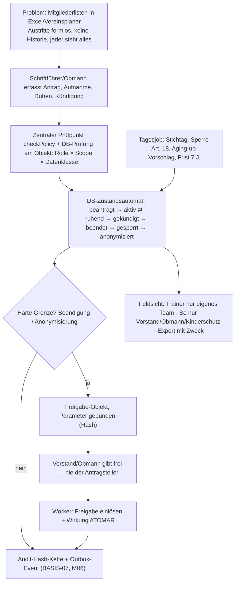

# Bau-Dossier — VV-M05 · Mitglieder (Mitglieder-CRM)

> **Bau-Dossier (K29).** Phase 1, gebaut zur geschärften Spec (Baubuch v0.20, Steckbrief VV-M05; Register P50).
> **Status: in_bau — Vier-Augen-Review (Codex + Gemini) und Betreiber-Freigabe ausstehend.** Die Bau-KI öffnet kein Gate.

## 1. Kopf

- **Code:** VV-M05 (+ BASIS-02-Kern, P50-8)
- **Name:** Mitglieder (Mitglieder-CRM)
- **Version:** 1.0 (Phase 1)
- **Datum:** 24.09.2026
- **Verantwortlich:** Bau-KI Claude Code + Opus 5.5 (Stufe hoch) · Prüf-KI GPT-5.x Codex + Gemini 3.x Pro (ausstehend) · Freigabe Betreiber
- **Status/Gate:** in_bau · Gate 1 (M05) **gesperrt bis Review + Betreiber-Freigabe**
- **Grundlage:** Bau-Auftrag v1.1 (Projektordner, `VV_M05_Bau-Auftrag.md`) · Register P50 · [project.json-Fragment](../../project/fragments/VV-M05.project.json)

## 2. Was

Die **fachliche Mitgliedschaft** auf Basis der Person (BASIS-01): wer ist auf welche Art, seit wann, in welchem Status Mitglied. Umgesetzt (Use Cases des Steckbriefs):

- **Mitgliedsarten zweischichtig:** System-Kategorien (aktiv · unterstützend · fördernd · Ehren · Jugend) + versionierte Vereins-Mitgliedsarten mit Kündigungsregel (Frist + Stichtag) und Aging-up-Regel.
- **Mitglied** (Person × Verein, Mitgliedsnummer) + **historisierte Mitgliedschaftsperioden**; Wiedereintritt = neue Periode; höchstens eine offene Periode.
- **Status-Lebenszyklus** beantragt → aktiv ⇄ ruhend → gekündigt → beendet → gesperrt → anonymisiert (+ abgelehnt), Kündigungs-Rücknahme vor Stichtag.
- **Vier-Augen an den harten Grenzen:** Beendigung (Austritt/Ausschluss/Todesfall) und Anonymisierung nur als Freigabe-Objekt; Ausführung durch den Worker nach fremder Freigabe.
- **Append-only-Verlauf** von Status und Mitgliedsart; **Aging-up** als Vorschlag + Bestätigung; **Q01-Fristen** (konservativ 7 J.) mit Sperre (Art. 18) und Anonymisierungs-Antrag.
- **Feldsicht/Export** nach Rollen × Scope × Datenklasse (Ö/S/Se); Export mit Pflicht-Zweck.
- **Import-Schnittstelle** (Q05): idempotent über Mitgliedsnummer, nur mit eingelöster Batch-Freigabe; [Vereinsplaner-Mapping](../../project/mappings/vereinsplaner.v1.json) (40 Spalten, nur Kopfzeile).
- **BASIS-02-Kern** (mitgebaut): Scope-Baum, Rollen/Rechteprofile als Daten, zentrale DB-Autorisierung, SoD-Kern bei Zuweisung, Principal-Bindung (OIDC-Subjekt → Person).
- **HTTP-API** `/api/m05/*` (Principal nur aus verifiziertem OIDC-Token) + **Worker** (Executor `m05.execute`, Tagesjob `m05.daily`).

## 3. Warum so

- **DB als letzte Instanz (ADR-01/04/05):** Alle Schreibwege laufen über `SECURITY DEFINER`-Funktionen der Rolle `vv_definer` (NOSUPERUSER, **NOBYPASSRLS**) → RLS gilt auch in der Fachlogik; die Web-Rolle hat **kein** DML auf Mitgliedsdaten. Alternative „App prüft, DB speichert" verworfen: jeder App-Fehler wäre ein Leck ([ADR-01](../adr/ADR-01.md), [ADR-04](../adr/ADR-04.md)).
- **Zwei Prüflinien:** zentraler App-Prüfpunkt `checkPolicy` (validator-erzwungen) + Objektprüfung in der DB mit demselben `app.actor` ([ADR-09](../adr/ADR-09.md)).
- **Vier-Augen atomar (ADR-07):** Consume der Freigabe und Wirkung in **einer** Transaktion; Parameter kommen aus dem gebundenen, hash-geprüften Antrag — nicht vom Aufrufer. Stage-0-`executeBindingEffect` löst getrennt ein; für M05 bewusst atomar ([ADR-07](../adr/ADR-07.md)).
- **Zustandsautomat als Trigger:** erlaubte Übergänge + Pflicht-Kontext (cmd/exec/job/import) DB-seitig; keine Beendigung ohne Freigabe-Kontext, auch nicht als Tabelleneigentümer.
- **Transactional Outbox + pg-boss (ADR-05/06):** Folgewirkungen (BASIS-07-Beitrag, M06-Info) nur als Events; Tagesjob idempotent.
- **Kein Freitext im Kern (B01-1, P50-3):** Gründe als Katalog; Se-Ausschlussgrund nur für Vorstand/Obmann/Kinderschutz (P50-13).
- **Konservative Frist (P50-9):** ohne BASIS-07 kein Finanzbezug bekannt → 7 J. („längste Frist gewinnt", Q01).

## 4. Wie umgesetzt

- **Migrationen** (idempotent, atomar): [0006 BASIS-02-Kern](../../db/migrations/0006_rbac_core.sql) · [0007 M05-Schema](../../db/migrations/0007_m05_schema.sql) · [0008 M05-Funktionen](../../db/migrations/0008_m05_functions.sql) · [0009 Freigabe-INSERT-Härtung](../../db/migrations/0009_approval_insert_hardening.sql) · Seed [0002 synthetisch](../../db/seed/0002_m05_synthetic.sql).
- **Tabellen (M05):** `membership_category`, `membership_end_reason` (global) · `membership_type`, `membership_type_version`, `member`, `membership_period`, `membership_status_history`, `membership_type_assignment`, `membership_proposal`, `m05_settings`, `m05_approval_request`, `m05_import_batch` (alle `tenant_id` + ENABLE/FORCE RLS + Policy, zusammengesetzte FKs).
- **Tabellen (BASIS-02):** `role_type`, `role_permission`, `sod_rule` (global) · `scope_node`, `principal_link`; `role_assignment` erweitert (Scope-FK, Widerruf, SoD-Trigger).
- **Befehle (vv_app):** `m05_type_create/new_version`, `m05_settings_update`, `m05_apply/admit/reject/suspend/resume/change_type/withdraw_notice`, `m05_request_termination`, `m05_decide`, `m05_decide_proposal`, `m05_import_request/decide`; Lesen `m05_list_members`, `m05_get_member`, `m05_export_members`, `m05_pending_approvals`; BASIS-02 `rbac_assign_role/revoke_role/create_scope_node`.
- **Nur Worker (vv_worker):** `m05_execute` (Freigabe-Ausführung), `m05_job_daily`, `m05_import_apply`.
- **Nur Betreiber-Onboarding (Bootstrap):** `rbac_onboard_root`, `rbac_link_principal`.
- **App:** [policy.ts](../../apps/web/src/platform/policy.ts) (DB-gestützt, fail-closed, Deny-Audit) · [mitglieder.action.ts](../../apps/web/src/modules/mitglieder/mitglieder.action.ts) · [mitglieder.routes.ts](../../apps/web/src/modules/mitglieder/mitglieder.routes.ts) · [mitglieder.schema.ts](../../apps/web/src/modules/mitglieder/mitglieder.schema.ts).
- **Worker:** [jobs/m05.ts](../../apps/worker/src/jobs/m05.ts) (Outbox `m05.execute`, pg-boss `m05.daily` 02:15 Europe/Vienna).
- **Events (Outbox):** `m05.membership.applied/admitted/rejected/suspended/resumed/type_changed/notice_recorded/notice_withdrawn/ended/locked/anonymized/imported`, `m05.approval.requested`, `m05.execute`, `m05.aging_up.proposed/data_missing`, `m05.export.done`, `basis02.role.assigned/revoked` — nur IDs/Codes.
- **Grenzen:** keine Beitrags-/Zahlungslogik, kein Consent, keine Personen-Anonymisierung (BASIS-04), kein Frontend (M33), kein Agent, keine Import-Engine (Q05), Erziehungsberechtigten-Sicht folgt mit der BASIS-01-Beziehung (bis dahin deny-by-default).

## 5. Wie getestet

- **Gegenproben gegen echte PostgreSQL 16 (adversarial):** [scripts/m05_db_asserts.py](../../scripts/m05_db_asserts.py) — **115/115**; aufgerufen aus [ci_db_asserts.sh](../../scripts/ci_db_asserts.sh) (Stage-0-Proben + neue S0-1/S0-2) — Nachweis: [evidence/m05/db-asserts.txt](../../evidence/m05/db-asserts.txt).
- **Validatoren LIVE (gate-blockierend):** [evidence/m05/validator-report.json](../../evidence/m05/validator-report.json); **Selbsttest** 12/12 (inkl. neuer Umgehungsproben).
- **Unit- + Integrationstests:** Web 17/17 (Policy-Prüfpunkt, Validierung, API end-to-end gegen DB), Worker 12/12 (Vier-Augen-Adversarial, Executor, Outbox → Worker → Wirkung genau einmal) — [evidence/m05/tests.txt](../../evidence/m05/tests.txt).
- **Gesamtnachweis + Akzeptanzkriterien AK-01…AK-12:** [evidence/m05/verification.md](../../evidence/m05/verification.md) · Checkliste DoD: [evidence/m05/gate-m05-checklist.md](../../evidence/m05/gate-m05-checklist.md).

## 6. Sicherheit & Datenschutz

- **Mandantentrennung:** RLS FORCE auf allen 14 neuen mandantenbezogenen Tabellen; Definer-Rolle ohne BYPASSRLS; Isolationstests (A ≠ B, fremder Actor, fremder Worker-Kontext, Cross-Tenant-FK).
- **Deny-by-default:** ohne Tenant, Actor, Principal oder passende Rolle × Scope × Datenklasse kein Zugriff; Systemakteure haben keine Rollen; keine M05/RBAC-Funktion für PUBLIC ausführbar.
- **Vier-Augen:** Selbst-Freigabe, fremder/abgelaufener/ungebundener Antrag, Parameter-Tausch, Replay, Freigeber ohne (weiterhin gültiges) Recht → verweigert; Fehler → Rollback, Freigabe bleibt unverbraucht.
- **Stage-0-Befunde, im M05-Bau entdeckt und geschlossen (Migration 0009):** **S0-1** `vv_app` konnte eine bereits „genehmigte" Freigabe direkt EINFÜGEN (status/approved_by frei) · **S0-2** `requested_by` frei setzbar (Antragsteller-Spoofing). Jetzt normalisiert ein BEFORE-INSERT-Trigger jede neue Freigabe auf `pending`; für die Web-Rolle gilt `requested_by = app.actor`. Zwei neue gate-blockierende Gegenproben.
- **Datenklassen:** Mitgliedsart Ö; Status/Daten/Nummer/Austrittsgrund S; Ausschlussgrund + Beschluss-Ref. Se; Export nie Se; Outbox/Audit ohne Klartext-Personenbezug (geprüft).
- **Q01/Art. 18/Löschung:** Sperre nach Beendigung, Anonymisierung nur mit Vier-Augen nach Fristablauf; Hash-Kette bleibt intakt (verifiziert).
- **Audit:** jede Zustandsänderung, jede Verweigerung am Prüfpunkt, jede versuchte SoD-Verletzung.
- **Nur synthetische Daten** (Seed/Tests; K31-Guard grün); Vereinsplaner-Export nicht im Repo, nur Spaltennamen.

## 7. Visual (Pflicht)

## 8. Nutzen in Klartext

Der Verein weiß jederzeit, wer seit wann in welcher Art Mitglied ist — mit lückenloser Historie statt verstreuter Listen. Austritte und Ausschlüsse passieren nie „nebenbei": eine zweite Person gibt frei, Fristen und Aufbewahrung laufen automatisch und DSGVO-konform. Trainer sehen nur ihr Team, sensible Gründe nur der Vorstand.

## 9. Änderungshistorie

- 24.09.2026 — v1.0: M05 Phase 1 gebaut (Bau-KI Opus 5.5) nach Grill P50 (13 Entscheidungen); BASIS-02-Kern mitgebaut; Stage-0-Befunde S0-1/S0-2 geschlossen; Validator-Härtung ADR-01 (Statement-Reihenfolge) + ADR-04 (je Aktion, Fachbefehle); Vereinsplaner-Mapping v1. **Review + Freigabe ausstehend.**
