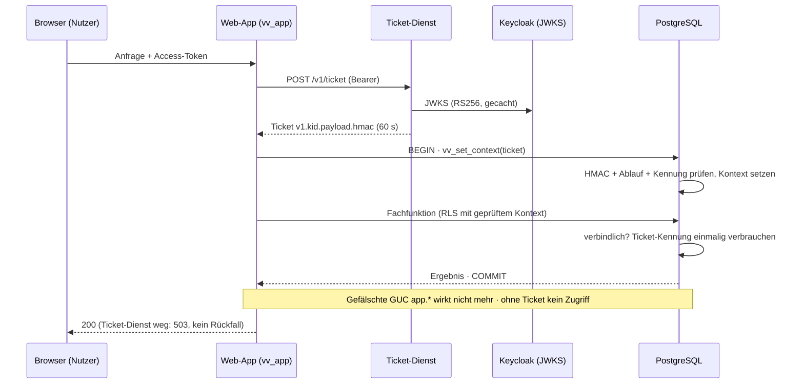

# Bau-Dossier — VV-SEC-01 · Kontext-Signatur (Ticket-Dienst, C-1)

> **Bau-Dossier (K29).** Sicherheits-Architekturschritt C-1, gebaut nach Bau-Auftrag v1.0 (freigegeben 25.09.2026, Grill **P58**).
> **Status: in Bau / verifiziert** — Vier-Augen-Review (GPT-6 Sol + Gemini 3.1 Pro) und Betreiber-Freigabe per Pull Request **ausstehend**. Die Bau-KI öffnet kein Gate.

## 1. Kopf

- **Code:** VV-SEC-01 (neuer Code-Bereich `VV-SEC-##` für bausteinübergreifende Sicherheitsschritte)
- **Name:** Kontext-Signatur (Ticket-Dienst) — schließt Codex-Befund **C-1** (P54)
- **Version:** 1.0 (Bau)
- **Datum:** 25.09.2026
- **Verantwortlich:** Bau-KI Claude Code + Opus 5.5 (hoch) · Prüf-KI GPT-6 Sol (Codex, Live-Lauf) + Gemini 3.1 Pro (ausstehend) · Freigabe Betreiber
- **Status/Gate:** `in_bau` · Gate 1 gesperrt bis Review-Konvergenz + Merge durch den Betreiber
- **Grundlage:** Bau-Auftrag `VV_C1_Bau-Auftrag_Kontext-Signatur.md` v1.0 · Register P54, P57, P58 · [project.json-Fragment](../../project/fragments/VV-SEC-01.project.json)

## 2. Was

Die Datenbank nimmt Mandant und Nutzer **nur noch mit einem Nachweis** an, den die Web-App nicht selbst herstellen kann (**Schutzziel B**): Auch eine vollständig übernommene App handelt nur im Namen von Nutzern, deren echte Anfrage gerade läuft.

- **Ticket-Dienst** (eigener Container `ticket`): prüft das Keycloak-Access-Token (RS256 via JWKS, Issuer, Audience, nur `typ=Bearer`, Token-Alter ≤ 300 s) und stellt ein **60-s-Ticket** aus: `v1.<kid>.<payload>.<hmac>` mit Mandant, Nutzer (`sub`), `iat`, `exp`, `jti`. HMAC-SHA256 mit einem Schlüssel, den **nur Dienst und DB** kennen.
- **DB-Prüfung** `vv_set_context(ticket)`: Signatur (pgcrypto, zeitkonstanter Vergleich), Schlüssel-Kennung, Ablauf, Gültigkeitsfenster ≤ 60 s, exakte Nutzlast, bekannter Mandant, kein Systemakteur, nicht verbrauchte Kennung, **ein Kontext je Transaktion**.
- **Geprüfter Kontext statt GUC:** `vv_current_tenant()` / `vv_actor()` lesen nur noch die Kontextzeile (Backend + Transaktion); `set_config('app.…')` wirkt nicht mehr.
- **Einmal-Tickets** für die 8 verbindlichen Befehle: Freigabe/Ablehnung (`m05_decide`, `m05_import_decide`), Beendigungsantrag, Import-Antrag, Export, Lesen gesperrter Daten (Art. 18), Rollenvergabe/-entzug. Lesen und normale Erfassung bleiben innerhalb von 60 s mehrfach möglich.
- **Keine Direktrechte mehr für `vv_app`:** alle Tabellen-/Spalten-/Sequenzrechte entzogen; auch die Stage-0-Demo-Lesepfade laufen über `basis01_list_persons()` / `basis02_list_role_assignments()`. `vv_decide_approval` nur noch intern.
- **Worker ohne Tickets:** feste Positivliste (11 Systemfunktionen), fester Akteur `system:worker` über `vv_worker_context()`; keine Nutzer-Funktion aufrufbar.
- **Schlüsselwechsel** per [scripts/rotate_ticket_key.sh](../../scripts/rotate_ticket_key.sh) (`init` · `rotate` · `retire` · `emergency` · `status`), zwei Schlüssel in der Übergangszeit, jeder Schritt im Audit.
- **Fail-closed:** Ticket-Dienst weg → Web-App **503 „vorübergehend nicht verfügbar“**, kein Rückfall, kein Datenzugriff; Worker läuft unabhängig weiter.

## 3. Warum so

- **Warum überhaupt:** Die DB schützte gegen Programmfehler, nicht gegen eine übernommene App. Mit den App-Zugangsdaten ließen sich `app.tenant_id`/`app.actor` frei setzen — Mandant B lesen, Antragsteller + Freigeber in einer Verbindung ([Negativnachweis am alten Stand](../../evidence/c1/negativnachweis-master.txt)). Frist: **vor dem ersten echten Datenimport (S1)**, weil der Pilot laut K34 echte Daten inkl. Minderjähriger verarbeitet.
- **Eigener Ticket-Dienst statt Keycloak-Umbau** (Grill P58, Punkt 3): HS256-Realm-Schlüssel hätte einen Generalschlüssel verteilt und den OIDC-Standard gebrochen; Public-Key-Prüfung in der DB bräuchte eine abgekündigte Fremd-Erweiterung. HMAC mit pgcrypto ist Kern-Postgres ([ADR-03](../adr/ADR-03.md), [ADR-11](../adr/ADR-11.md)).
- **Kontext in einer Tabelle statt in einer GUC:** Custom-GUCs sind für jede Rolle frei beschreibbar. Die Kontextzeile ist nur für die Prüfrolle `vv_ticketcheck` schreibbar; `vv_current_tenant()`/`vv_actor()` sind SQL-Standard-Funktionen (`BEGIN ATOMIC`), deren Namen beim Anlegen gebunden werden — kein Schatten über `search_path` möglich. `TEMP` ist für alle entzogen, `CREATE` hat `vv_app` nirgends ([ADR-01](../adr/ADR-01.md)).
- **Einmal-Ticket nur für Verbindliches** (Grill P58, Punkt 4): Lesen darf die Anfrage mehrfach, Bindendes genau einmal — Verbrauch atomar über den Primärschlüssel, nur erfolgreiche Aktionen verbrauchen (Rollback gibt frei).
- **Worker ohne Tickets** (Punkt 5): Hintergrundjobs haben keine Nutzeranfrage; sie dürfen nie als Mensch auftreten — deshalb fester Systemakteur und getrennte Positivlisten ([ADR-06](../adr/ADR-06.md)).
- **Fail-closed** (Punkt 7): jeder Rückfall auf den alten Weg wäre eine Hintertür; deckt sich mit B09-1 und K36 (Degradation statt Umgehung).
- **Nicht umgesetzt (Nicht-Ziele):** nutzersignierte Freigaben (Option C, Passkey) — der Dienst bleibt dafür erweiterbar; keine Änderung an Keycloak; keine M05-Fachlogik-Änderung außer der Kontext-Übergabe.

## 4. Wie umgesetzt

- **Migration** [0013_kontext_signatur.sql](../../db/migrations/0013_kontext_signatur.sql) (idempotent, atomar):
  - Rolle `vv_ticketcheck` (NOLOGIN, NOBYPASSRLS) besitzt die Prüf-/Kontextfunktionen.
  - Tabellen `ticket_key` (nur `vv_ticketcheck` lesbar; deaktiviert = Geheimnis gelöscht), `ticket_used` (verbrauchte Kennungen), `vv_ctx` (UNLOGGED, Kontext je Backend + Transaktion, CHECK: Systemkontext nie menschlich).
  - Funktionen `vv_set_context`, `vv_worker_context`, `vv_worker_tenants`, `vv_bootstrap_context` (nur Superuser: Seeds/Onboarding/Tests), `vv_ticket_once`, `vv_ticket_housekeeping`, Schlüsselverwaltung `vv_ticket_key_add/expire/disable/event`.
  - Umgestellt: `vv_current_tenant`, `vv_actor`, `vv_decide_approval`, `vv_approval_insert_guard`, `rbac_onboard_root`, `rbac_link_principal`; SoD-Trigger jetzt **fail-closed ohne passenden Kontext**.
  - Verbindliche Befehle: Kern umbenannt in `…__kern` (nur Definer), neuer gleichnamiger Einstieg ruft zuerst `vv_ticket_once`.
  - RLS-Policies werten den Kontext als **InitPlan** aus (einmal je Abfrage).
  - Rechte als **Positivlisten** (`vv_app`: 32 Funktionen, `vv_worker`: 11), PUBLIC-EXECUTE auf allen eigenen Funktionen entzogen, `TEMP` entzogen.
- **Ticket-Dienst** [apps/ticket](../../apps/ticket/src/): [ticket.ts](../../apps/ticket/src/ticket.ts) (Format/HMAC), [verify.ts](../../apps/ticket/src/verify.ts) (RS256-JWKS, Issuer, Audience, `typ`, Token-Alter), [keyring.ts](../../apps/ticket/src/keyring.ts) (Docker-Secret, Neuladen bei Änderung/SIGHUP), [server.ts](../../apps/ticket/src/server.ts) (ein Endpunkt, Rate-Limit je Quelle und Nutzer, Logs ohne Tokens), Health `/health`.
- **Web-App:** [platform/ticket.ts](../../apps/web/src/platform/ticket.ts) (Ticket holen, 2 s Timeout, fail-closed) · [platform/tenant.ts](../../apps/web/src/platform/tenant.ts) (`withTenant(client, ticket)` → `vv_set_context`) · [server.ts](../../apps/web/src/server.ts) (401/503-Logik) · Aktionen reichen nur das Ticket weiter.
- **Worker:** [jobs/m05.ts](../../apps/worker/src/jobs/m05.ts) und [approval_store.ts](../../apps/worker/src/agents/approval_store.ts) → `vv_worker_context`; Tagesjob räumt `ticket_used` auf.
- **Compose:** Dienst `ticket` mit Secret `ticket_keyring`, `restart: always`, Healthcheck, `read_only`, `cap_drop: ALL`, nur internes Netz `ticketnet` (kein Port nach außen); Web erhält nur `TICKET_URL` ([docker-compose.yml](../../docker-compose.yml)).
- **Betrieb:** Schlüsselwechsel planmäßig **alle 90 Tage** (`status` warnt), sofort bei Verdacht (`emergency`), nach Restore aus altem Backup (ADR-11). Keyring-Datei 0600, Eigentümer = Container-Nutzer (`KEYRING_UID=1000`), verschlüsselte Kopie per `sops`/`age` (`SOPS_AGE_RECIPIENTS`).
- **Grenzen:** Ausfall-Alarm wird angebunden, sobald das ADR-11-Monitoring steht (bis dahin Healthcheck + Log); Image-Digests folgen P47.

## 5. Wie getestet

- **C-1-Gegenproben DoD 1–7 gegen echte PostgreSQL 16:** [scripts/c1_db_asserts.py](../../scripts/c1_db_asserts.py) — **70/70** ([Ausgabe](../../evidence/c1/c1-asserts.txt)): P54-Reproduktion schlägt fehl, keine Direkt-Grants (alle Schemata), exakte Funktions-Positivlisten, 14 Fälschungs-/Ablaufvarianten, Mandantentrennung, Einmal-Tickets (seriell, gleiche Transaktion, parallel), Worker-Trennung, echter Schlüsselwechsel mit dem Betreiber-Skript, InitPlan.
- **Regression auf dem Ticket-Weg (ohne Abschwächung):** Stage-0-Proben **38/38** + M05 **140/140** ([db-asserts.txt](../../evidence/c1/db-asserts.txt)); wo `vv_app` früher auf eine Normalisierung stieß, gilt jetzt der stärkere Nachweis „kein Recht“, die Normalisierung selbst wird über die Definer-Rolle weiter geprüft.
- **Ende-zu-Ende** [scripts/c1_e2e.sh](../../scripts/c1_e2e.sh) — echte Kette Token → Ticket-Dienst → Web → DB, inkl. **503 bei Dienstausfall ohne Datenzugriff** und Wiederanlauf ([c1-e2e.txt](../../evidence/c1/c1-e2e.txt)).
- **Tests:** Web 23/23, Worker 18/18, Ticket-Dienst 21/21 (u. a. alg-Tausch, ID-/Refresh-Token, fremder Aussteller, Rate-Limit, keine Tokens im Log); Typecheck rc=0; `npm audit` 0 (3 Apps); Worker-Start-Probe grün; `docker compose config` valide; Migrationen 0006–0013 idempotent.
- **Validatoren:** LIVE grün inkl. neuem Check **C-1** (keine `app.*`-GUC in App-Code, kein Schlüsselmaterial in der Web-App, keine Direkt-Grants), Selbsttest **22/22** ([validator-report.json](../../evidence/c1/validator-report.json)).
- **Leistung:** [perf.md](../../evidence/c1/perf.md) — `vv_set_context` ≈ 0,5 ms je Anfrage; RLS mit InitPlan ≈ 3× schneller als Auswertung je Zeile.
- **Gesamtnachweis:** [evidence/c1/verification.md](../../evidence/c1/verification.md) · DoD-Checkliste [gate-c1-checklist.md](../../evidence/c1/gate-c1-checklist.md) · Review-Harness [scripts/review_c1.sh](../../scripts/review_c1.sh).

## 6. Sicherheit & Datenschutz

- **Schlüssel:** HMAC-Schlüssel (32 Byte) nur im Ticket-Dienst (Docker-Secret) und in `ticket_key` (nur Prüfrolle); nie in Web-App, Repo, CI-Variablen oder Logs (CI: Wegwerf-Schlüssel je Lauf). Validator erzwingt: kein Schlüsselmaterial im Web-Code.
- **Datenklassen:** Ticket enthält nur Referenzen (Mandanten-UUID, OIDC-`sub`), keinen Klartext-Personenbezug. Audit der Schlüsselereignisse nur mit Kennung.
- **Restrisiken (dokumentiert, Schutzziel B bewusst):**
  - Eine übernommene App kann für **laufende** Anfragen innerhalb von 60 s im Namen dieses Nutzers handeln und ein abgefangenes Access-Token bis zu 300 s zum Ticket-Holen nutzen (Token-Alter-Grenze). Freigaben „nur durch den Nutzer selbst“ = Option C (Passkey), später.
  - Hält die Web-App künftig **Refresh-Tokens** (serverseitiger Login-Flow), könnte sie Tickets ohne laufende Anfrage erzeugen → Auflage für den Frontend-/Login-Bau: Refresh-Tokens nicht im Web-Server, oder Option C.
  - Superuser/Betreiber-Zugang bleibt allmächtig (Bootstrap-Kontext nur für Superuser); Schutz über ADR-11 (Zugang, Audit-Anchoring).
- **Freigaben:** keine bindende Wirkung ohne Betreiber-Freigabe; Merge nach `master` ist Betreiber-Entscheidung.

## 7. Visual

## 8. Nutzen in Klartext

Selbst wenn ein Angreifer die Web-Anwendung übernimmt, kann er in der Datenbank keine Vereine oder Personen erfinden und nicht nachts im Namen des Kassiers oder Obmanns handeln — die Datenbank verlangt für jede Anfrage einen kurzlebigen, fälschungssicheren Nachweis des angemeldeten Nutzers. Verbindliches wie Freigaben oder Exporte geht pro Nachweis genau einmal. So bleiben Mitgliederdaten, auch von Kindern und Jugendlichen, auch im schlimmsten Fall getrennt und nachvollziehbar.

## 9. Änderungshistorie

- **1.0 (25.09.2026):** Bau C-1 nach Bau-Auftrag v1.0 (P58) — Migration 0013, Ticket-Dienst, Web/Worker-Umstellung, Betreiber-Skript Schlüsselwechsel, Gegenproben/e2e/Validator, Evidenz `evidence/c1/`. Review ausstehend.
